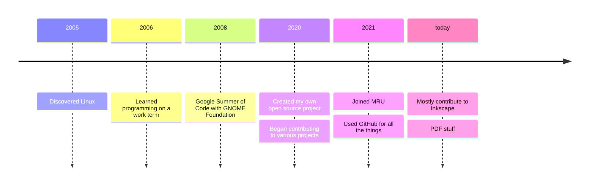

```mermaid
timeline
    2005: Discovered Linux
    2006: Learned programming on a work term
    2008: Google Summer of Code with GNOME Foundation
    2020: Created my own open source project
        : Began contributing to various projects
    2021: Joined MRU
        : Used GitHub for all the things
    today: Mostly contribute to Inkscape
        : PDF stuff 
```