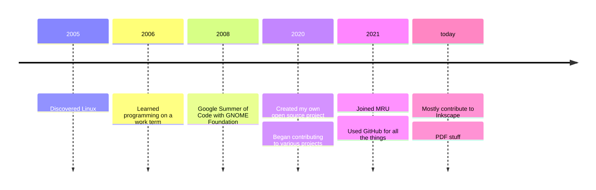

<!-- 
_class: title_slide
_paginate: skip
-->

# <!--fit-->COMP 3700A: Contributing to Open Source
### <!--fit-->Introduction

Charlotte Curtis
September 9, 2026

---

## Who am I?

**Name:** Charlotte Curtis

**Pronouns:** She/her

**Office:** B102-4

**Email:** ccurtis@mtroyal.ca

**Office hours:** [Book here](https://calendar.google.com/calendar/u/0/appointments/AcZssZ1DErlRJ8cNGFn27y-fiFzPEXgDKu8r7LXkGOY=)

---

## My history with open source

> I still have a lot to learn!

---

<!-- _class: discussion_question -->

Who are you?

---

## Course content
- Some technical content on common tools and workflows, including git, forking and merging, yaml, markdown, grep
- The various roles and organizational structures of OSS projects
- Licensing and ownership
- Release cycles and continuous integration/deployment (CI/CD)
- Non code contributions
- Funding models

> Probably some more things that I've forgotten

---

## Deliverables

| Component              | Weight |
| ---------------------- | ------ |
| Lab activities         | 14%    |
| Class participation    | 21%    |
| Midterm (Oct 28)       | 15%    |
| Term project (3 parts) | 50%    |

- Midterm is the only exam
- Term project: contributing to a community of your choice
- Lots of discussion and sharing back to the class (3x presentations)
- Class participation includes contributing to course repo

---

## What is Open Source?
You might see the terms:
- Free software
- Free open source software (FOSS)
- Free/libre open source software (FLOSS)
- Humanitarian free open source software (HFOSS)
- Open hardware
- Open educational resources
- and probably more!

---

## Free as in freedom, not as in beer

Four essential freedoms, according to the [Free Software Foundation](https://www.gnu.org/philosophy/free-sw.html):

0. **Run** the program as you wish
1. **Study** and **change** the program
2. **Redistribute copies**
3. Distribute your **modified versions**

> The [Open Source Definition](https://opensource.org/osd) is somewhat looser, but essentially the same
> "Free" does not refer to cost!

---

## Why open source?

- More eyes -> more bugfixes
- Transparency -> better security
- Control over your own software
- Learning from others

<footer>Illustration created by Scriberia with The Turing Way community, used under a CC BY 4.0 licence. DOI: 10.5281/zenodo.3332807 <a href="https://www.turing.ac.uk/blog/open-source-software-why-it-matters-and-how-get-involved">(source)</a></footer>

---

## Why this course?
This course aims to provide:

- Exposure to real-world teams, projects, code, policies, procedures, etc
- Messy codebases
- Time and space to fail, learn, and contribute

> Ultimate goal is to break down barriers

---

<!-- _class: discussion_question -->

What are some barriers to contributing to open source?

---

## Where can you find OSS?
- You use it every day!
- Check out https://awesomeopensource.com
- Popular hosting platforms include:
    - [GitHub](https://github.com/)
    - [GitLab](https://gitlab.com/)
    - [CodeBerg](https://codeberg.org/)

> **Homework**: for next lecture, respond to the [discussion post](https://github.com/mru-open-source/f26/discussions/1) with links to 3-5 OSS projects that you use
